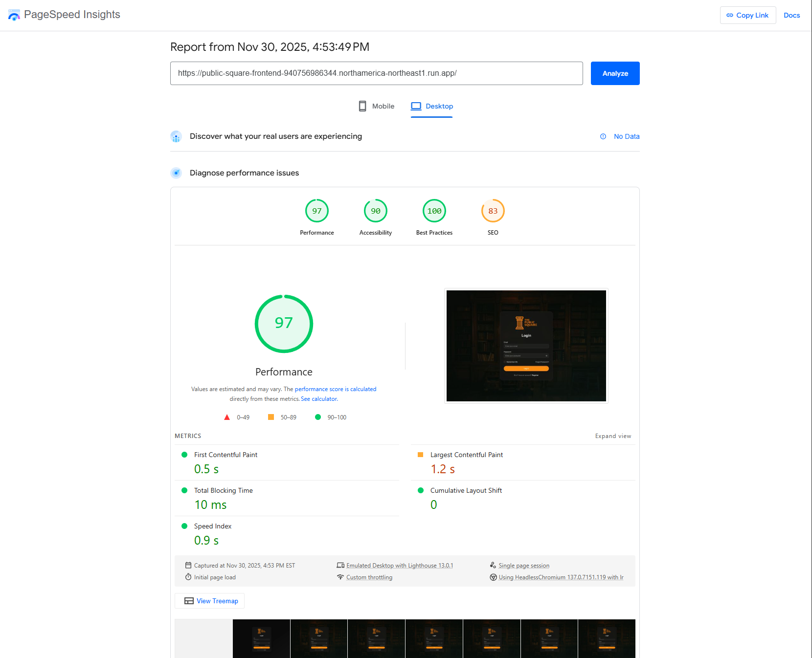
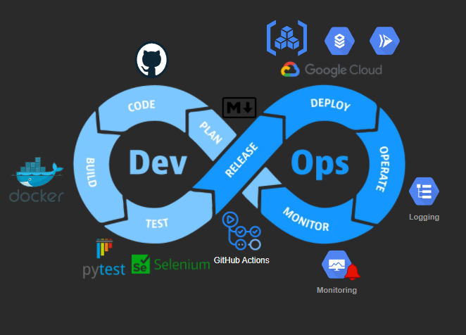
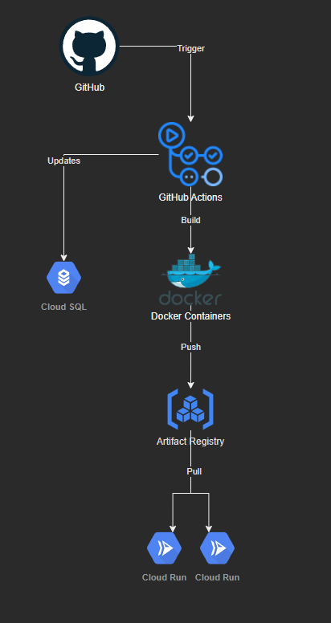

# Ontario Tech University CSCI4230 Final Project

This is a final project for Ontario Tech University's Advanced Web Development course (csci4230).

## Requirements

The core requirements for the final project are as follows.

### API & Project Evaluation Criteria

#### API Design and Integration (15%)

- [x] Clear and well-structured API endpoints
- [x] Proper use of HTTP methods (GET, POST, PUT, DELETE)
- [x] Integration with at least one external API
- [x] Documentation of the API endpoints
  - Auto-generated with FastAPI at `/docs` (Swagger UI) and `/redoc` (ReDoc)

#### Architectural Design (15%)

- [x] Implementation of chosen architecture (e.g., Microservices, Monolithic, MVC)
- [x] Proper separation of concerns (frontend, backend, database)
- [x] Diagram and explanation of the chosen architecture (UML package and class diagrams)
  - See [ARCHITECTURE.md](docs/ARCHITECTURE.md)

#### Authentication and Security (10%)

- [x] Implementation of secure user authentication (e.g., OAuth, JWT, etc.)
- [x] Protection of sensitive routes with proper authorization checks
- [x] Handling of user sessions and secure storage of credentials

#### Database Design and ORM (10%)

- [x] Database schema design
- [x] Use of an ORM for database interactions (e.g., SQLAlchemy, Django ORM)
- [x] Implementation of CRUD operations
- [x] Use of relationships between data entities

#### Testing and Quality Assurance (10%)

- [ ] Unit tests covering core functionalities
- [ ] Integration tests for API endpoints
- [ ] End-to-end tests with Selenium

#### Deployment and DevOps (10%)

- [x] Deployment to a cloud platform or a general-purpose server
  - https://public-square-frontend-940756986344.northamerica-northeast1.run.app/
- [x] Use of Docker for deployment consistency
- [x] Setup of a CI/CD pipeline
- [x] Documentation of deployment process
- [x] Use of HTTPS with either HTTP/2 or HTTP/3

#### Performance Optimization (5%)

- [x] Analysis of application performance using <https://pagespeed.web.dev/>



#### Version Control and Collaboration (5%)

- [x] Use of Git and GitHub/GitLab for version control
- [x] Regular commits with clear messages
- [x] Properly documented README file with project setup instructions
  - See [GETTING_STARTED.md](docs/GETTING_STARTED.md)

#### Code Quality and Documentation (5%)

- [x] Proper use of comments and docstrings
- [x] Adherence to coding standards and best practices (e.g., PEP 8 for Python)
- [x] Comprehensive project documentation, including setup, usage, and architecture

#### Presentation and Demonstration (15%)

- [ ] Clear and organized presentation of the project
- [ ] Demonstration of key features
- [ ] Explanation of design decisions and challenges faced
- [ ] Q&A session to assess understanding and depth of knowledge

## Project Overview

Project Name: **_The Public Square_**

Our project idea is to build a book club web application. The core concepts in the app will be to allow for the formulation of groups, discussion of topics in themes (think reddit but for book/theme discussion pages), and a meeting scheduler to allow users to schedule regular meeting times for their clubs. Integrated with the club and discussion features is the users library. This is where a user can create a digital version of their personal collection of books. We've included ISBN lookup for easy integration of books published since the late 1960s. Extending this feature can allow for batch upload of ISBNs and even multi-modal AI technology that allows for ISBN lookup by image (think- take a picture of your bookshelf and the system would add it to your app library).Other ambitions would be to implement WebRTC for real-time video streaming.

We'll add some CI/CD pipelines to allow for the deployment of new versions and set automated deployment dependent on tests passing.

## Getting Started

For complete setup instructions including backend, frontend, and Docker setup, see **[GETTING_STARTED.md](docs/GETTING_STARTED.md)**.

**Quick Links:**

- [Prerequisites](docs/GETTING_STARTED.md#prerequisites)
- [Backend Setup](docs/GETTING_STARTED.md#backend-setup)
- [Frontend Setup](docs/GETTING_STARTED.md#frontend-setup)
- [Running the Full Stack](docs/GETTING_STARTED.md#running-the-full-stack)
- [Troubleshooting](docs/GETTING_STARTED.md#troubleshooting)

### Features

**User Authentication & Management**

- Secure user registration and login with JWT-based authentication
- Password hashing with bcrypt
- Refresh token rotation for enhanced security
- Session management across multiple devices
- User profile management

**Book Clubs**

- Create and manage book clubs with customizable topics and descriptions
- Join existing clubs or create new ones
- Club membership management with role-based access control (owner/member)
- Member capacity limits for clubs
- View club members and their roles
- Leave or remove members from clubs

**Personal Library**

- Add books to personal library with ISBN lookup via Open Library API
- Track reading status (unread, reading, finished)
- Rate books (0-5 stars) and write reviews
- Add personal notes to books
- Mark books as favorites
- Track reading statistics (total books, books read, reading progress)
- View detailed book information including multi-volume series support

**Reading Lists** (Planned)

- Create custom reading lists to organize books
- Add/remove books from reading lists
- Reorder books within lists with drag-and-drop functionality
- Default reading list support
- Multiple reading lists per user

**Book Catalog**

- Global book catalog shared across all users
- ISBN-based book lookup and automatic metadata retrieval
- Support for publishers, editions, and book versions
- Multi-volume series tracking (series title, volume number)
- Book cover images and descriptions

**Discussion Pages** (Planned)

- Reddit-style discussion pages for topics and themes
- Follow pages of interest
- Topic-based organization (planned feature)

**Meeting Scheduling** (Planned)

- Schedule recurring club meetings
- iCal calendar integration
- Meeting status tracking (scheduled, in-progress, completed, cancelled)
- Actual vs scheduled time tracking

**Security Features**

- JWT access tokens with short expiration
- HTTP-only refresh tokens for enhanced security
- Password change tracking
- Device and IP tracking for sessions
- Protected API routes with dependency injection
- CORS configuration for secure cross-origin requests

### Technologies

The stack consists of the following:

- React/Shadcn frontend using TypeScript
- WebRTC for video streaming\*
- Python/FastAPI/Alembic backend
- PostgreSQL database
- GitHub Actions for CI/CD
  - CodeQL SAST scanning
  - Flake8 for linting (PEP8, McCabe, PyFlakes)
- Docker
- Selenium
- Google cloud for web hosting
- Radix for worker/queue service

\*Time constraints did not allow for the implementation of live video streaming.

### Development Process

Development standards are written in a global .claude directory. Here, rules were written for frontend, backend, and global coding standards. This laid out to the agentic models things such as file structure, api references, type casting, and other standards.

#### Frontend

The frontend was built with React TypeScript as the framework, Shadcn and Radix for the component library and Tailwind CSS as the styling framework. We used a Shadcn MCP server with Claude Code to enhance the capability for component library lookup; ensuring all components are locally declared for optimal developer customization. The frontend structure is defined strictly in the following:

```
frontend/
└── app/
    ├── public/                      # Static assets
    ├── src/
    │   ├── global/                  # Global shared resources
    │   │   ├── api/                 # API layer
    │   │   │   ├── actions/         # API endpoint actions
    │   │   │   │   ├── auth/        # Authentication endpoints
    │   │   │   │   ├── clubs/       # Club endpoints
    │   │   │   │   └── library/     # Library endpoints
    │   │   │   ├── models/          # API response/request models
    │   │   │   │   ├── auth.models.ts
    │   │   │   │   ├── club.models.ts
    │   │   │   │   ├── library.models.ts
    │   │   │   │   └── index.ts
    │   │   │   ├── http-client.ts   # Axios HTTP client configuration
    │   │   │   └── index.ts
    │   │   │
    │   │   ├── components/          # Shared components
    │   │   │   ├── ui/              # shadcn/ui components (~18 components)
    │   │   │   ├── AppLayout.tsx
    │   │   │   ├── AuthGuard.tsx
    │   │   │   ├── Header.tsx
    │   │   │   └── Navigation.tsx
    │   │   │
    │   │   ├── models/              # TypeScript type definitions
    │   │   │   ├── auth.models.ts
    │   │   │   ├── club.models.ts
    │   │   │   ├── library.models.ts
    │   │   │   └── index.ts
    │   │   │
    │   │   ├── store/               # Redux store
    │   │   │   ├── slices/
    │   │   │   │   ├── authSlice.ts
    │   │   │   │   ├── clubsSlice.ts
    │   │   │   │   ├── librarySlice.ts
    │   │   │   │   └── index.ts
    │   │   │   └── index.ts
    │   │   │
    │   │   ├── hooks/               # Custom React hooks
    │   │   │   ├── useAuth.ts
    │   │   │   ├── useAppDispatch.ts
    │   │   │   ├── useAppSelector.ts
    │   │   │   └── index.ts
    │   │   │
    │   │   ├── providers/           # React context providers
    │   │   │   ├── AppProvider.tsx
    │   │   │   ├── ReduxProvider.tsx
    │   │   │   └── index.ts
    │   │   │
    │   │   ├── contexts/            # React contexts
    │   │   │   ├── SidebarContext.tsx
    │   │   │   └── ThemeContext.tsx
    │   │   │
    │   │   ├── utils/               # Utility functions
    │   │   │   ├── errorHandler.ts
    │   │   │   ├── password-validator.ts
    │   │   │   ├── session-manager.ts
    │   │   │   └── index.ts
    │   │   │
    │   │   └── config.ts            # Global configuration
    │   │
    │   ├── modules/                 # Feature modules
    │   │   ├── home/
    │   │   │   ├── pages/
    │   │   │   │   └── HomePage.tsx
    │   │   │   └── routes.tsx
    │   │   │
    │   │   ├── login/
    │   │   │   ├── pages/
    │   │   │   │   ├── Login.tsx
    │   │   │   │   ├── Register.tsx
    │   │   │   │   └── index.ts
    │   │   │   └── routes.tsx
    │   │   │
    │   │   ├── clubs/
    │   │   │   ├── components/
    │   │   │   │   ├── ClubCard.tsx
    │   │   │   │   ├── CreateClubModal.tsx
    │   │   │   │   └── index.ts
    │   │   │   ├── pages/
    │   │   │   │   ├── Clubs.tsx
    │   │   │   │   └── pages/
    │   │   │   │       └── club/
    │   │   │   │           ├── components/
    │   │   │   │           │   ├── ClubHeader.tsx
    │   │   │   │           │   ├── ClubOverview.tsx
    │   │   │   │           │   ├── ClubMembers.tsx
    │   │   │   │           │   ├── ClubDiscussions.tsx
    │   │   │   │           │   ├── CurrentBook.tsx
    │   │   │   │           │   ├── NextMeeting.tsx
    │   │   │   │           │   └── index.ts
    │   │   │   │           └── Club.tsx
    │   │   │   └── routes.tsx
    │   │   │
    │   │   ├── library/
    │   │   │   ├── components/
    │   │   │   │   ├── AddBookModal.tsx
    │   │   │   │   ├── BookCard.tsx
    │   │   │   │   ├── BookDetailModal.tsx
    │   │   │   │   ├── EditBookModal.tsx
    │   │   │   │   └── LibraryStats.tsx
    │   │   │   ├── pages/
    │   │   │   │   └── Library.tsx
    │   │   │   └── routes.tsx
    │   │   │
    │   │   └── pages/               # Pages feature module
    │   │
    │   ├── routes/                  # Application routing configuration
    │   ├── lib/                     # Third-party library configurations
    │   ├── assets/                  # Images, fonts, etc.
    │   ├── App.tsx
    │   ├── App.css
    │   ├── main.tsx
    │   └── index.css
    │
    ├── dist/                        # Production build output
    ├── package.json
    ├── vite.config.ts
    └── tsconfig.json
```

#### Backend

The backend consists of an API built with Python using FastAPI and a PostgreSQL database. We use a python package manager called uv which is a hyper-fast package manager aiming to replace the slow-moving pip (though, is built on top of pip with Rust). Some other technologies used in the backend are Docker, Selenium, Pytest, and SQLAlchemy/Alembic for data modelling and migrations. We also use a very minute and opinionated backend api structure like the following:

```
backend/
├── alembic/                     # Database migrations
│   ├── versions/                # Migration version files
│   ├── env.py                   # Alembic environment configuration
│   ├── script.py.mako          # Migration template
│   └── README
│
├── src/
│   ├── api/                     # API route definitions (FastAPI routers)
│   │   ├── auth.py              # Authentication routes
│   │   ├── books.py             # Book routes
│   │   ├── clubs.py             # Club routes
│   │   ├── library.py           # Library routes
│   │   ├── meetings.py          # Meeting routes
│   │   ├── pages.py             # Page routes
│   │   ├── users.py             # User routes
│   │   ├── deps.py              # API dependencies (auth, db session)
│   │   └── __init__.py
│   │
│   ├── handlers/                # Business logic layer
│   │   ├── books/               # Book business logic
│   │   ├── clubs/               # Club business logic
│   │   ├── library/             # Library business logic
│   │   ├── meetings/            # Meeting business logic
│   │   ├── pages/               # Page business logic
│   │   ├── users/               # User business logic
│   │   │   └── auth/            # Authentication logic
│   │   └── user/                # User-specific logic
│   │       ├── clubs/           # User club operations
│   │       └── meetings/        # User meeting operations
│   │
│   ├── storage/                 # Data access layer
│   │   └── data/
│   │       └── sql/             # SQL database repositories
│   │           ├── base_storage.py
│   │           ├── books/       # Book data access
│   │           ├── clubs/       # Club data access
│   │           ├── meetings/    # Meeting data access
│   │           ├── pages/       # Page data access
│   │           ├── users/       # User data access
│   │           ├── refresh_tokens/  # Token data access
│   │           └── user/        # User-specific data access
│   │               ├── books/
│   │               ├── clubs/
│   │               ├── meetings/
│   │               └── pages/
│   │
│   ├── models/                  # SQLAlchemy ORM models & Pydantic schemas
│   │   ├── base.py              # Base model classes
│   │   ├── user.py              # User models (UserORM, UserSecurityORM)
│   │   ├── book.py              # Book models (BookORM, PublisherORM, etc.)
│   │   ├── club.py              # Club models (ClubORM, ClubMeetingORM)
│   │   ├── meeting.py           # Meeting models (MeetingORM)
│   │   ├── page.py              # Page models (PageORM)
│   │   ├── group.py             # Group models (Group)
│   │   ├── role.py              # Role models (Role)
│   │   ├── refresh_token.py     # Refresh token model
│   │   └── __init__.py
│   │
│   ├── transports/              # Data serialization layer
│   │   └── json/                # JSON response formatters
│   │
│   ├── scripts/                 # Utility scripts
│   ├── config.py                # Application configuration (Pydantic Settings)
│   ├── database.py              # Database connection & session management
│   ├── security.py              # Security utilities (JWT, password hashing)
│   ├── main.py                  # FastAPI application entry point
│   └── __init__.py
│
├── tests/                       # Test suite
│   ├── test_api/                # API endpoint tests
│   │   ├── test_auth.py
│   │   ├── test_clubs.py
│   │   ├── test_library.py
│   │   ├── test_users.py
│   │   └── __init__.py
│   ├── test_handlers/           # Business logic tests
│   ├── test_storage/            # Data access tests
│   ├── conftest.py              # Pytest fixtures & configuration
│   └── __init__.py
│
├── main.py                      # Application entry point (imports from src)
├── requirements.txt             # Python dependencies
├── pyproject.toml               # Project metadata & tool configs
├── uv.lock                      # UV package manager lock file
├── pytest.ini                   # Pytest configuration
├── alembic.ini                  # Alembic configuration
├── Dockerfile                   # Docker container definition
├── Makefile                     # Development commands
├── .env                         # Environment variables
├── .env.example                 # Environment variables template
├── .flake8                      # Flake8 linter configuration
└── README.md
```

#### Local Dev

Local development makes use of a Makefile that will setup the environments, install dependencies, run migrations, and deploy to the server. The use of CMake greatly helps new dev onboarding with simplifying common sets of commands used for setup.

### API Documentation

The Public Square API provides auto-generated interactive documentation powered by FastAPI:

**Swagger UI** - Interactive API testing interface

- Production: `https://public-square-backend-940756986344.northamerica-northeast1.run.app/docs`
- Local: `http://localhost:8000/docs`
- Features:
  - Try endpoints directly in your browser
  - View request/response schemas
  - Test authentication flows
  - See all available endpoints organized by tags

**ReDoc** - Clean, readable API reference

- Production: `https://public-square-backend-940756986344.northamerica-northeast1.run.app/redoc`
- Local: `http://localhost:8000/redoc`
- Features:
  - Professional documentation layout
  - Better for reading and sharing
  - Printable format
  - Three-panel design with navigation

Both documentation interfaces are automatically generated from the FastAPI application's route definitions, Pydantic models, and docstrings.

### Quality Standards

- Adherence to defined code standards:
  - CodeQL security scanning.
  - PEP8.
  - ESLint for TypeScript rules.
  - Flake8 for Python rules.

### Deployment Process

We deploy to the google cloud automatically on each commit to the main branch (trunking). Our CI/CD pipeline is outlined below.

#### CI/CD

Our development methodology follows closely to traditional DevOps. In the following diagram the technologies for each stage of the DevOps lifecycle can be seen.



In detail:

1. Plan: Markdown
2. Code: GitHub
3. Build: Docker
4. Testing: Pytest and Selenium
5. Release: GitHub Actions
6. Deploy: Google Artifact Registry, Cloud SQL, and Cloud Run
7. Operate: Google Cloud Logging
8. Monitor: Google Cloud Monitoring

Deployment pipeline in flowchart:



#### Workflow Overview

The workflow will:

1. ✅ Run backend tests with pytest
2. ✅ Build and push backend Docker image to Artifact Registry
3. ✅ Build and push frontend Docker image to Artifact Registry
4. ✅ Deploy backend to Cloud Run with environment variables
5. ✅ Update/create database migration Cloud Run Job
6. ✅ Run database migrations
7. ✅ Deploy frontend to Cloud Run
