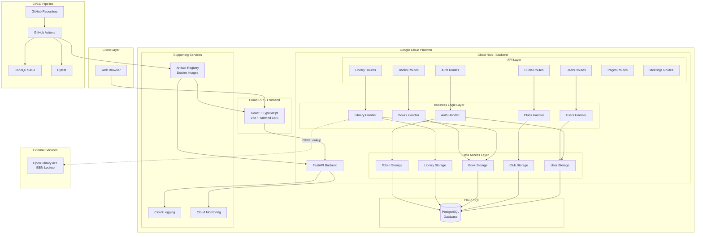
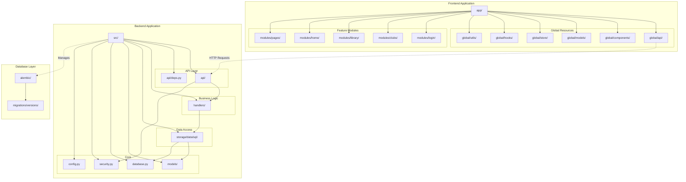
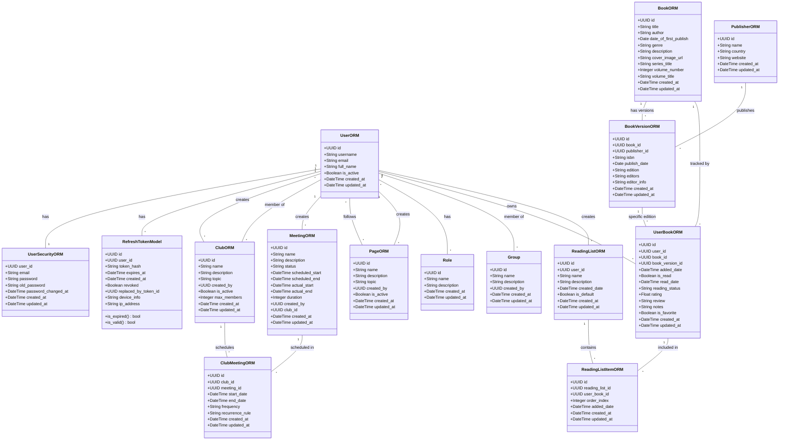
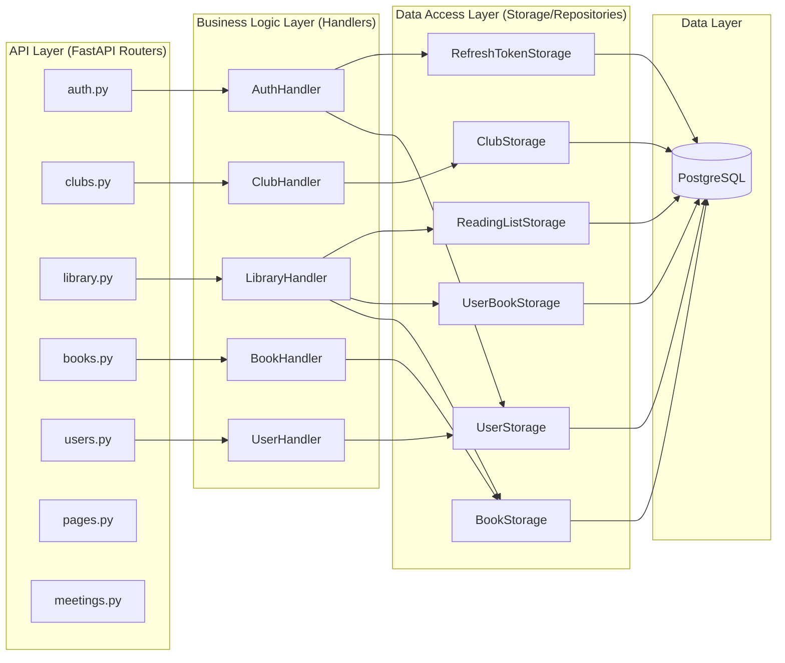
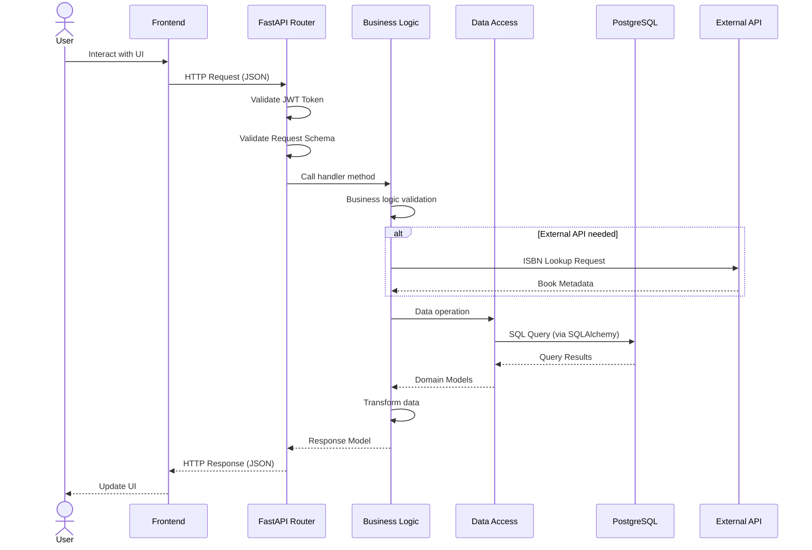
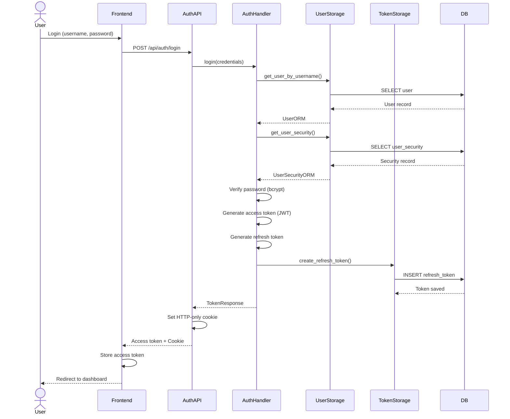
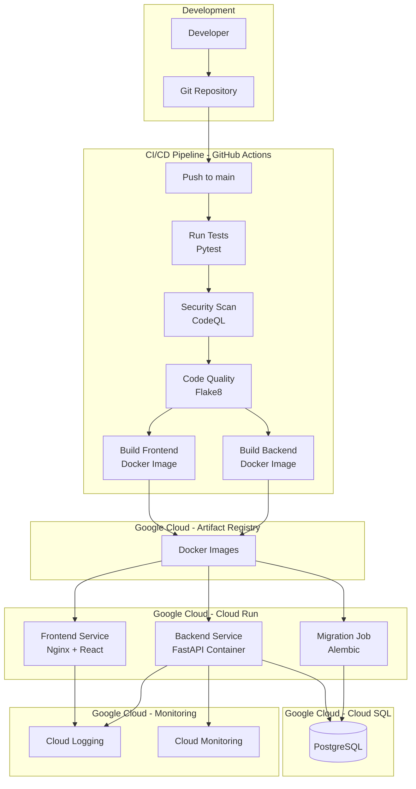

# Architecture Documentation

## System Architecture Overview

The Public Square follows a **three-tier monolithic architecture** with clear separation of concerns between the presentation layer (frontend), application logic layer (backend), and data layer (database). The system is containerized using Docker and deployed on Google Cloud Platform.

## High-Level Architecture

## Package Structure Diagram

## Data Model Class Diagram

## Backend Layer Architecture

## Request Flow Diagram

## Authentication Flow

## Deployment Architecture

## Key Architectural Decisions

### 1. Monolithic Architecture
**Decision**: Use a monolithic backend with FastAPI rather than microservices.

**Rationale**:
- Simpler deployment and development for a university project
- Reduced operational complexity
- Faster development cycle
- Sufficient for expected user load
- Can be refactored to microservices later if needed

### 2. Three-Layer Architecture
**Decision**: Strict separation into API, Business Logic, and Data Access layers.

**Rationale**:
- Clear separation of concerns
- Easier testing and mocking
- Independent layer modification
- Business logic reusability
- Database technology independence

### 3. Repository Pattern
**Decision**: Implement repository pattern for data access.

**Rationale**:
- Abstraction over database operations
- Easier unit testing with mocks
- Centralized query logic
- Database migration flexibility

### 4. JWT with Refresh Tokens
**Decision**: Use short-lived JWT access tokens with long-lived HTTP-only refresh tokens.

**Rationale**:
- Enhanced security with token rotation
- XSS attack mitigation (HTTP-only cookies)
- Session management across devices
- Token revocation capability

### 5. Frontend State Management
**Decision**: Use Redux Toolkit for global state management.

**Rationale**:
- Centralized application state
- Predictable state updates
- DevTools support for debugging
- Integration with React best practices

### 6. Containerization
**Decision**: Deploy using Docker containers on Google Cloud Run.

**Rationale**:
- Environment consistency
- Easy scaling
- Platform independence
- CI/CD integration
- Serverless cost model

### 7. Automated Migrations
**Decision**: Use Alembic for database schema migrations.

**Rationale**:
- Version-controlled schema changes
- Rollback capability
- Team collaboration support
- Automated deployment integration

## Technology Stack Justification

### Frontend
- **React + TypeScript**: Type safety, component reusability, large ecosystem
- **Vite**: Fast build times, modern tooling, HMR support
- **Redux Toolkit**: Simplified Redux setup, built-in best practices
- **Tailwind CSS**: Utility-first styling, rapid development, consistency
- **Shadcn/Radix**: Accessible components, full customization

### Backend
- **FastAPI**: Async support, automatic API docs, Pydantic validation
- **SQLAlchemy**: Powerful ORM, migration support, async capabilities
- **PostgreSQL**: ACID compliance, JSON support, reliability
- **Pydantic**: Data validation, settings management, type safety
- **Alembic**: Database migration management

### DevOps
- **Docker**: Containerization, reproducible environments
- **GitHub Actions**: CI/CD automation, integrated with repository
- **Google Cloud Run**: Serverless containers, auto-scaling, cost-effective
- **Pytest**: Comprehensive testing framework, fixtures, async support

## Security Architecture

### Authentication & Authorization
1. **Password Security**: bcrypt hashing with salt
2. **Token Management**: JWT access tokens (15 min) + refresh tokens (7 days)
3. **Session Tracking**: Device and IP logging
4. **Token Rotation**: Refresh token rotation on renewal
5. **CORS**: Configured cross-origin resource sharing
6. **Dependency Injection**: Secure route protection with FastAPI dependencies

### Data Protection
1. **HTTP-Only Cookies**: Prevent XSS attacks on refresh tokens
2. **Environment Variables**: Sensitive config in .env files
3. **SQL Injection Prevention**: SQLAlchemy parameterized queries
4. **Input Validation**: Pydantic schema validation

## Performance Considerations

1. **Async Operations**: FastAPI async/await for I/O operations
2. **Database Indexing**: Indexed columns for frequent queries
3. **Connection Pooling**: SQLAlchemy connection management
4. **Caching**: Frontend state caching with Redux
5. **Lazy Loading**: Component and route code splitting
6. **CDN**: Static asset delivery via Cloud Run

## Scalability Strategy

1. **Horizontal Scaling**: Cloud Run automatic instance scaling
2. **Database Scaling**: Cloud SQL read replicas (future)
3. **Stateless Backend**: JWT-based authentication enables scaling
4. **Containerization**: Easy deployment of multiple instances
5. **Load Balancing**: Cloud Run built-in load balancing
